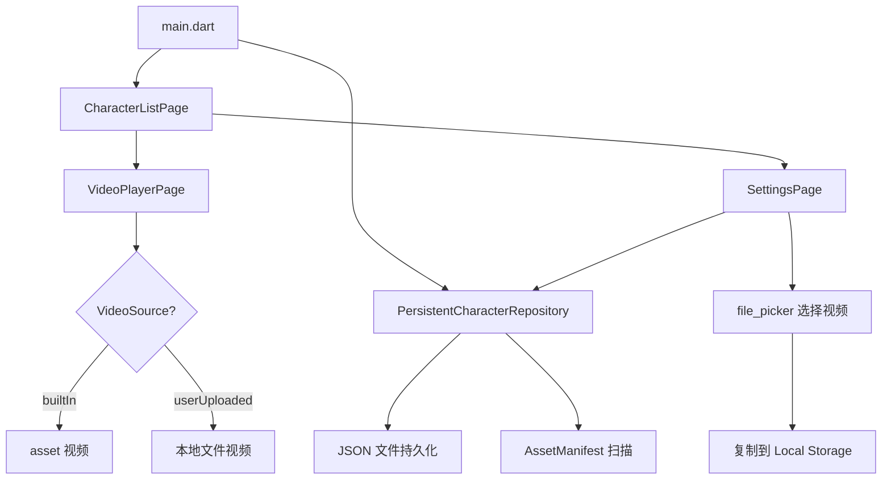
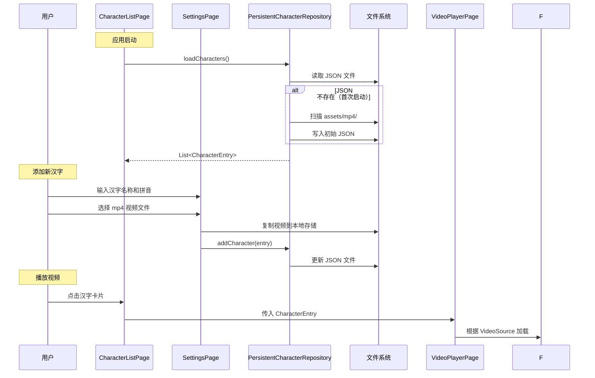

# 设计文档：汉字视频存储

## 概述

本设计为汉字学习应用引入结构化的汉字数据模型和持久化存储系统。核心变更包括：

1. 新增 `CharacterEntry` 数据模型和 `VideoSource` 枚举，替代当前的纯字符串表示
2. 重构 `CharacterRepository`，从仅读取 AssetManifest 升级为支持 JSON 持久化的完整 CRUD 仓库
3. 适配 `VideoPlayerPage`，根据 `VideoSource` 类型选择 `asset()` 或 `file()` 加载方式
4. 新增 `SettingsPage`，提供汉字添加、视频上传和条目管理功能
5. 在 `CharacterListPage` 的 AppBar 中集成设置入口

关键设计决策：
- 使用 JSON 文件（而非 SharedPreferences）进行持久化，因为汉字列表可能较大且结构化
- 使用 `path_provider` 获取应用文档目录，存放用户上传视频和 JSON 数据文件
- 使用 `file_picker` 让用户从设备中选择 mp4 文件

## 架构

### 整体架构图



### 数据流



### 文件结构变更

```
lib/
├── main.dart                          # 修改：注入 PersistentCharacterRepository
├── models/
│   └── character_entry.dart           # 新增：CharacterEntry + VideoSource
├── repositories/
│   └── character_repository.dart      # 重构：抽象接口 + PersistentCharacterRepository
├── pages/
│   ├── character_list_page.dart       # 修改：使用 CharacterEntry，添加设置按钮
│   ├── video_player_page.dart         # 修改：接收 CharacterEntry，适配双来源
│   └── settings_page.dart             # 新增：设置页面
├── widgets/
│   └── character_card.dart            # 修改：接收 CharacterEntry
└── utils/
    └── filter.dart                    # 修改：过滤 CharacterEntry 列表
```

## 组件与接口

### 1. CharacterEntry 数据模型 (`lib/models/character_entry.dart`)

```dart
enum VideoSource { builtIn, userUploaded }

class CharacterEntry {
  final String name;     // 汉字名称，如 "苗"
  final String pinyin;   // 拼音，如 "miao"
  final VideoSource videoSource;

  const CharacterEntry({
    required this.name,
    required this.pinyin,
    required this.videoSource,
  });

  /// 获取视频文件路径
  String get videoPath {
    switch (videoSource) {
      case VideoSource.builtIn:
        return 'assets/mp4/$pinyin.mp4';
      case VideoSource.userUploaded:
        // 实际路径需在运行时拼接应用文档目录
        return '$pinyin.mp4';
    }
  }

  Map<String, dynamic> toJson() => {
    'name': name,
    'pinyin': pinyin,
    'videoSource': videoSource.name,
  };

  factory CharacterEntry.fromJson(Map<String, dynamic> json) => CharacterEntry(
    name: json['name'] as String,
    pinyin: json['pinyin'] as String,
    videoSource: VideoSource.values.byName(json['videoSource'] as String),
  );

  @override
  bool operator ==(Object other) =>
      identical(this, other) ||
      other is CharacterEntry &&
          name == other.name &&
          pinyin == other.pinyin &&
          videoSource == other.videoSource;

  @override
  int get hashCode => Object.hash(name, pinyin, videoSource);
}
```

### 2. CharacterRepository 接口与实现 (`lib/repositories/character_repository.dart`)

```dart
abstract class CharacterRepository {
  Future<List<CharacterEntry>> loadCharacters();
  Future<void> addCharacter(CharacterEntry entry);
  Future<void> deleteCharacter(CharacterEntry entry);
}
```

`PersistentCharacterRepository` 实现要点：
- 构造时接收应用文档目录路径（通过 `path_provider` 获取）
- 使用 `characters.json` 文件存储序列化数据
- `loadCharacters()`：读取 JSON 文件；若不存在则扫描 AssetManifest 生成初始数据
- `addCharacter()`：追加条目并写入 JSON
- `deleteCharacter()`：移除条目、写入 JSON，若为 userUploaded 则同时删除视频文件

### 3. SettingsPage (`lib/pages/settings_page.dart`)

职责：
- 显示所有 CharacterEntry 列表，标注来源类型
- 提供"添加汉字"按钮，弹出表单对话框（输入汉字名称、拼音）
- 使用 `file_picker` 选择 mp4 文件
- 将选中文件复制到应用文档目录，以 `{pinyin}.mp4` 命名
- 验证拼音唯一性和文件格式
- 支持滑动删除 userUploaded 条目（禁止删除 builtIn 条目）

### 4. VideoPlayerPage 适配

修改 `VideoPlayerPage` 接收 `CharacterEntry` 参数：
- `builtIn`：使用 `VideoPlayerController.asset(entry.videoPath)`
- `userUploaded`：使用 `VideoPlayerController.file(File('$docDir/${entry.videoPath}'))`
- 错误处理保持不变（显示"该视频暂不可用"）

### 5. CharacterListPage 修改

- `_allCharacters` 类型从 `List<String>` 改为 `List<CharacterEntry>`
- AppBar 添加设置图标按钮，导航到 SettingsPage
- 从 SettingsPage 返回时调用 `_loadCharacters()` 刷新列表
- `CharacterCard` 接收 `CharacterEntry`，显示 `entry.name`

### 6. filter 工具函数修改

```dart
List<CharacterEntry> filter(List<CharacterEntry> characters, String query) {
  if (query.isEmpty) return characters;
  return characters.where((c) => c.name.contains(query) || c.pinyin.contains(query)).toList();
}
```

搜索同时匹配汉字名称和拼音。

## 数据模型

### CharacterEntry

| 字段 | 类型 | 说明 |
|------|------|------|
| name | String | 汉字名称（如 "苗"） |
| pinyin | String | 拼音（如 "miao"），同时作为视频文件名 |
| videoSource | VideoSource | 枚举：builtIn 或 userUploaded |

### VideoSource 枚举

| 值 | 说明 |
|----|------|
| builtIn | 预打包在 assets/mp4/ 中的内置视频 |
| userUploaded | 用户上传，存储在应用文档目录中 |

### 持久化格式 (characters.json)

```json
[
  {"name": "苗", "pinyin": "miao", "videoSource": "builtIn"},
  {"name": "田", "pinyin": "tian", "videoSource": "builtIn"},
  {"name": "自定义字", "pinyin": "custom", "videoSource": "userUploaded"}
]
```

### 新增依赖

| 包名 | 用途 |
|------|------|
| path_provider | 获取应用文档目录路径 |
| file_picker | 从设备选择 mp4 文件 |


## 正确性属性

*属性（Property）是指在系统所有有效执行中都应成立的特征或行为——本质上是对系统应做什么的形式化陈述。属性是人类可读规格说明与机器可验证正确性保证之间的桥梁。*

### 属性 1：视频路径由拼音和来源正确派生

*对于任意* CharacterEntry，若 videoSource 为 builtIn，则 videoPath 应等于 `assets/mp4/{pinyin}.mp4`；若 videoSource 为 userUploaded，则 videoPath 应等于 `{pinyin}.mp4`。

**验证需求：1.3, 1.4, 3.1**

### 属性 2：序列化往返一致性

*对于任意* 有效的 CharacterEntry 列表，将其序列化为 JSON 后再反序列化，应产生与原始列表等价的对象列表。

**验证需求：2.6, 2.7**

### 属性 3：添加条目后可加载

*对于任意* 有效的 CharacterEntry，将其添加到 CharacterRepository 后，调用 loadCharacters() 返回的列表应包含该条目。

**验证需求：2.2**

### 属性 4：删除条目后不可加载

*对于任意* 已存在于 CharacterRepository 中的 CharacterEntry，将其删除后，调用 loadCharacters() 返回的列表不应包含该条目。

**验证需求：2.3**

### 属性 5：拼音唯一性约束

*对于任意* CharacterRepository 中的条目列表，不应存在两个不同条目具有相同的拼音值。当尝试添加一个拼音已存在的条目时，系统应拒绝该操作。

**验证需求：3.4, 5.6**

### 属性 6：文件格式验证

*对于任意* 文件路径字符串，若其扩展名不是 `.mp4`，则文件格式验证应返回失败。

**验证需求：5.7**

### 属性 7：内置条目不可删除

*对于任意* videoSource 为 builtIn 的 CharacterEntry，尝试删除该条目时系统应拒绝操作，条目列表保持不变。

**验证需求：6.5**

## 错误处理

| 场景 | 处理方式 |
|------|----------|
| JSON 文件损坏或解析失败 | 回退到 AssetManifest 扫描，重新生成初始数据 |
| 视频文件不存在或加载失败 | VideoPlayerPage 显示"该视频暂不可用"提示 |
| 用户上传非 mp4 文件 | SettingsPage 弹出提示"仅支持 mp4 格式" |
| 拼音重复 | SettingsPage 弹出提示"该拼音已被使用" |
| 文件复制失败 | SettingsPage 弹出错误提示，不创建条目 |
| 磁盘空间不足 | 捕获 IO 异常，提示用户存储空间不足 |
| 删除内置条目 | UI 层禁止操作（不显示删除选项或禁用按钮） |

## 测试策略

### 单元测试

单元测试用于验证具体示例、边界情况和错误条件：

- **CharacterEntry 构造与字段访问**：验证各字段正确赋值（需求 1.1, 1.2）
- **VideoPlayerPage 控制器选择**：验证 builtIn 使用 asset()，userUploaded 使用 file()（需求 4.1, 4.2）
- **首次启动初始化**：验证无 JSON 文件时从 AssetManifest 生成初始数据（需求 2.5）
- **视频加载失败处理**：验证显示错误提示（需求 4.3）
- **SettingsPage UI 元素**：验证添加按钮、表单、列表显示等（需求 5.1, 5.2, 6.1, 6.2, 6.3）
- **导航集成**：验证设置按钮存在、导航正确、返回刷新（需求 7.1, 7.2, 7.3）

### 属性测试

属性测试使用 property-based testing 库验证跨所有输入的通用属性。

**测试库**：使用 `glados` (Dart property-based testing 库)

**配置要求**：
- 每个属性测试至少运行 100 次迭代
- 每个测试必须以注释引用设计文档中的属性编号
- 标签格式：**Feature: character-video-storage, Property {number}: {property_text}**
- 每个正确性属性由一个属性测试实现

**属性测试列表**：

1. **视频路径派生** — 生成随机拼音字符串和 VideoSource 值，验证 videoPath 格式正确
   - 标签：`Feature: character-video-storage, Property 1: 视频路径由拼音和来源正确派生`

2. **序列化往返** — 生成随机 CharacterEntry 列表，序列化为 JSON 再反序列化，验证等价性
   - 标签：`Feature: character-video-storage, Property 2: 序列化往返一致性`

3. **添加后可加载** — 生成随机 CharacterEntry，添加到仓库后验证 loadCharacters 包含该条目
   - 标签：`Feature: character-video-storage, Property 3: 添加条目后可加载`

4. **删除后不可加载** — 从已有条目中随机选择一个删除，验证 loadCharacters 不再包含
   - 标签：`Feature: character-video-storage, Property 4: 删除条目后不可加载`

5. **拼音唯一性** — 生成随机条目列表，验证仓库中不存在重复拼音；尝试添加重复拼音时应失败
   - 标签：`Feature: character-video-storage, Property 5: 拼音唯一性约束`

6. **文件格式验证** — 生成随机文件路径（含各种扩展名），验证非 .mp4 扩展名被拒绝
   - 标签：`Feature: character-video-storage, Property 6: 文件格式验证`

7. **内置条目不可删除** — 生成随机 builtIn 条目，尝试删除后验证列表不变
   - 标签：`Feature: character-video-storage, Property 7: 内置条目不可删除`
