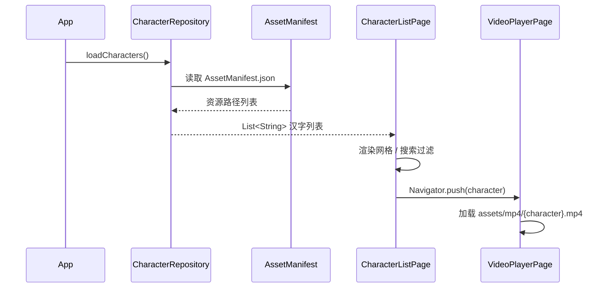

# 技术设计文档：儿童汉字学习 App

## 概述

本文档描述儿童汉字学习 Flutter App 的技术设计。App 从 `assets/mp4/` 目录动态加载汉字视频资源，在首页以网格卡片形式展示，支持实时搜索过滤，点击卡片后进入视频播放页。

技术栈：
- Flutter（Dart）
- `video_player` 插件（官方 Flutter 团队维护）用于视频播放
- `flutter_test` + `mockito` 用于单元测试
- `fast_check`（Dart 属性测试库）用于属性测试

---

## 架构

采用简单的分层架构，适合本项目规模：

```
┌─────────────────────────────────────┐
│              UI 层                   │
│  CharacterListPage  VideoPlayerPage  │
└──────────────┬──────────────────────┘
               │
┌──────────────▼──────────────────────┐
│            服务层                    │
│       CharacterRepository            │
└──────────────┬──────────────────────┘
               │
┌──────────────▼──────────────────────┐
│           数据源层                   │
│   AssetManifest（Flutter 资源清单）  │
└─────────────────────────────────────┘
```

**数据流：**

1. App 启动时，`CharacterRepository` 读取 Flutter 的 `AssetManifest.json`，扫描 `assets/mp4/` 目录下所有 `.mp4` 文件，提取文件名（去掉扩展名）作为汉字列表。
2. `CharacterListPage` 从 `CharacterRepository` 获取汉字列表，渲染网格卡片，并响应搜索输入进行实时过滤。
3. 用户点击卡片后，通过 Flutter 路由导航至 `VideoPlayerPage`，传入汉字字符串。
4. `VideoPlayerPage` 根据汉字拼接资源路径（`assets/mp4/{字}.mp4`），使用 `video_player` 加载并播放。



---

## 组件与接口

### CharacterRepository

负责从 Flutter 资源清单中发现汉字列表。

```dart
abstract class CharacterRepository {
  /// 返回所有可用汉字（即 assets/mp4/ 下存在对应 .mp4 的汉字）
  Future<List<String>> loadCharacters();
}

class AssetCharacterRepository implements CharacterRepository {
  @override
  Future<List<String>> loadCharacters() async {
    final manifest = await AssetManifest.loadFromAssetBundle(rootBundle);
    final keys = manifest.listAssets();
    return keys
        .where((k) => k.startsWith('assets/mp4/') && k.endsWith('.mp4'))
        .map((k) => k.replaceFirst('assets/mp4/', '').replaceAll('.mp4', ''))
        .toList();
  }
}
```

### CharacterListPage

首页，展示汉字网格并提供搜索功能。

- 状态：`List<String> _allCharacters`、`String _query`
- 计算属性：`List<String> get _filtered` — 根据 `_query` 过滤 `_allCharacters`
- 子组件：`SearchBar`（TextField）、`CharacterGrid`（GridView）、`CharacterCard`

### CharacterCard

单个汉字卡片 Widget，无状态。

```dart
class CharacterCard extends StatelessWidget {
  final String character;
  final VoidCallback onTap;
}
```

### VideoPlayerPage

视频播放页，接收汉字参数，加载并播放对应视频。

- 使用 `VideoPlayerController.asset('assets/mp4/$character.mp4')`
- 管理播放器生命周期（`initState` 初始化，`dispose` 释放）
- 状态：`VideoPlayerController`、`bool _hasError`

---

## 数据模型

本项目数据模型极简，核心数据为字符串列表。

### 汉字（Character）

用 `String` 直接表示，即单个汉字字符（如 `"苗"`）。

### 视频资源路径规则

```
assets/mp4/{character}.mp4
```

例：汉字 `"苗"` 对应路径 `assets/mp4/苗.mp4`

### 搜索过滤逻辑

```dart
List<String> filter(List<String> characters, String query) {
  if (query.isEmpty) return characters;
  return characters.where((c) => c.contains(query)).toList();
}
```

过滤规则：汉字字符串包含（`contains`）搜索词即视为匹配。空查询返回全部。

---

## 正确性属性

*属性（Property）是在系统所有合法执行中都应成立的特征或行为——本质上是对系统应做什么的形式化陈述。属性是人类可读规范与机器可验证正确性保证之间的桥梁。*

### 属性 1：过滤结果一致性

*对于任意*汉字列表和任意搜索词，`filter` 函数返回的每个汉字都应包含该搜索词；当搜索词为空时，返回结果应与原列表完全相同。

**验证需求：2.2、2.3**

### 属性 2：过滤结果为原列表子集

*对于任意*汉字列表和任意搜索词，`filter` 函数返回的结果中的每个元素都必须存在于原始列表中。

**验证需求：2.2**

### 属性 3：清除搜索恢复全部

*对于任意*汉字列表，先用任意非空查询词过滤，再用空字符串过滤，结果应等于原始列表。

**验证需求：2.5、2.3**

### 属性 4：视频播放页显示汉字名称

*对于任意*汉字字符串，渲染 `VideoPlayerPage` 后，页面中应包含该汉字字符串。

**验证需求：3.2**

### 属性 5：播放/暂停状态切换

*对于任意*播放器状态（播放中或暂停），点击播放/暂停按钮后，播放器状态应切换为相反状态（播放→暂停，暂停→播放）。

**验证需求：4.2**

---

## 错误处理

| 场景 | 处理方式 |
|------|----------|
| `assets/mp4/` 目录为空或无 `.mp4` 文件 | `CharacterListPage` 显示"暂无可学习的汉字"提示文字 |
| 搜索词无匹配结果 | `CharacterListPage` 显示"未找到匹配的汉字"提示文字 |
| 视频资源文件不存在（`VideoPlayerController` 初始化失败） | `VideoPlayerPage` 捕获异常，设置 `_hasError = true`，显示"该视频暂不可用"提示 |
| `AssetManifest` 加载失败 | `CharacterRepository` 返回空列表，UI 显示空状态提示 |

错误处理原则：所有错误均在 UI 层以友好提示呈现，不向用户暴露技术细节。

---

## 测试策略

### 双轨测试方法

采用单元测试与属性测试相结合的方式，两者互补：

- **单元测试**：验证具体示例、边界情况和错误处理
- **属性测试**：验证对所有输入都成立的普遍规则

### 单元测试

使用 `flutter_test`，重点覆盖：

- `CharacterRepository` 正确解析 `AssetManifest`，提取汉字列表
- `CharacterListPage` 空列表时显示提示文字（边界情况 1.4）
- `CharacterListPage` 搜索无结果时显示提示文字（边界情况 2.4）
- 点击汉字卡片后导航至 `VideoPlayerPage`（示例 3.1）
- `VideoPlayerPage` 存在返回按钮（示例 3.3）
- `VideoPlayerPage` 加载完成后自动播放（示例 4.1，使用 mock controller）
- 视频资源不存在时显示错误提示（边界情况 4.4）
- 视频播放完毕后停止在最后一帧（边界情况 4.3）

### 属性测试

使用 `dart_test` 配合手写生成器（Dart 生态暂无成熟 PBT 库，使用 `test` 包 + 随机生成器模拟），每个属性测试至少运行 **100 次迭代**。

每个属性测试需在注释中标注：
`// Feature: kids-character-learning, Property {编号}: {属性描述}`

| 属性 | 测试方法 | 生成器 |
|------|----------|--------|
| 属性 1：过滤结果一致性 | 生成随机汉字列表和随机查询词，验证每个结果都包含查询词 | 随机汉字字符串列表 + 随机查询词 |
| 属性 2：过滤结果为子集 | 生成随机汉字列表和随机查询词，验证结果中每项都在原列表中 | 同上 |
| 属性 3：清除搜索恢复全部 | 生成随机列表和非空查询词，先过滤再用空串过滤，验证等于原列表 | 随机汉字列表 + 非空查询词 |
| 属性 4：视频页显示汉字 | 生成随机汉字字符串，渲染页面，验证包含该字符串 | 随机单汉字字符串 |
| 属性 5：播放暂停切换 | 生成随机初始播放状态，点击按钮，验证状态翻转 | 随机布尔值（isPlaying） |

> 注：属性 1 和属性 2 可在同一测试函数中同时验证，避免重复生成数据。
