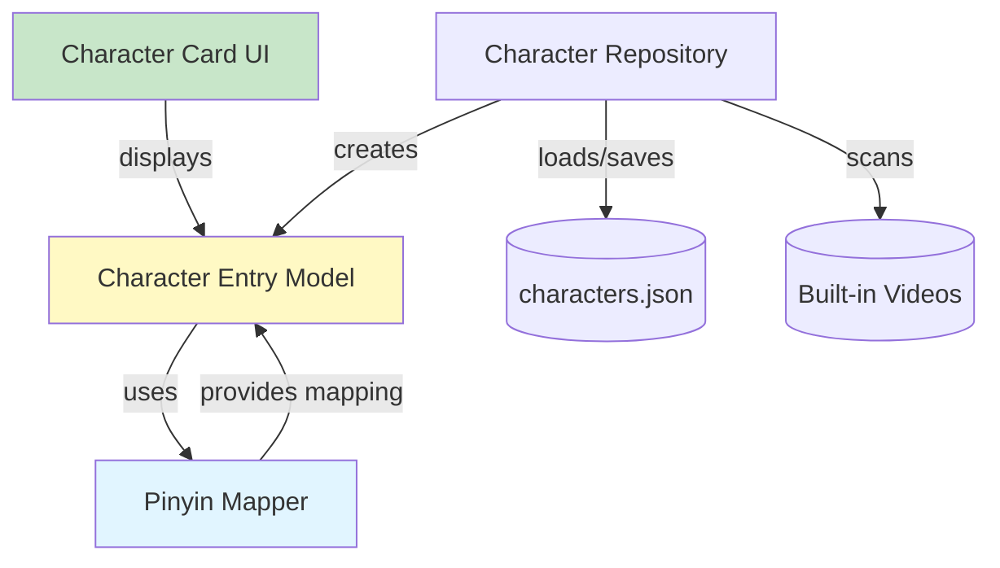

# 设计文档：拼音声调显示功能

## 概述

本设计文档描述了为儿童汉字学习应用添加带声调拼音显示功能的技术实现方案。当前应用使用简化拼音（如 'lv'）作为文件名和内部标识符，但在用户界面上需要显示标准的带声调拼音（如 'lǜ'）以提供准确的教育内容。

该功能的核心挑战包括：
- 建立从简化拼音到带声调拼音的映射关系
- 在不破坏现有文件系统结构的前提下扩展数据模型
- 提供双向转换能力以支持用户输入
- 确保向后兼容性和数据迁移的平滑性

## 架构

### 系统架构图



### 架构决策

1. **复用现有 chargeMap**: 直接扩展现有的 `chargeMap`，将其从 `Map<String, String>` (pinyin -> 汉字) 改为 `Map<String, CharacterInfo>` (pinyin -> {汉字, 带声调拼音})，保持代码简洁并避免重复。

2. **数据模型扩展而非替换**: `CharacterEntry` 保持现有的 `pinyin` 字段用于文件路径，通过添加 getter 方法提供带声调拼音，避免破坏现有序列化逻辑。

3. **延迟映射策略**: 带声调拼音在访问时动态生成，而非存储在 JSON 中，减少数据冗余并简化迁移。

4. **向后兼容的映射访问**: 提供辅助方法访问 chargeMap，确保现有代码继续工作。

## 组件和接口

### 1. CharacterInfo 数据类

**职责**: 封装汉字和对应的带声调拼音信息。

**接口设计**:

```dart
class CharacterInfo {
  final String character;  // 汉字
  final String tonedPinyin;  // 带声调拼音
  
  const CharacterInfo(this.character, this.tonedPinyin);
}
```

### 2. 扩展后的 chargeMap

**设计**: 将现有的 `Map<String, String>` 改为 `Map<String, CharacterInfo>`。

**映射表设计**:
- 使用 `const Map` 确保编译时常量，提高性能
- 包含所有现有 chargeMap 中的拼音键值
- 特殊处理 ü 的表示（lv -> lǜ, nv -> nǚ）
- 支持多音字的不同读音（de/de1, mi/mi1, you/you1, guo/guo1, xiang/xiang1）

**示例映射**:
```dart
const Map<String, CharacterInfo> chargeMap = {
  'lv': CharacterInfo('绿', 'lǜ'),
  'nv': CharacterInfo('女', 'nǚ'),
  'ba': CharacterInfo('八', 'bā'),
  'bai': CharacterInfo('百', 'bái'),
  'de': CharacterInfo('的', 'de'),  // 轻声
  'de1': CharacterInfo('得', 'dé'),
  // ... 其他条目
};
```

### 3. 辅助访问方法

**职责**: 提供便捷的访问方法，保持向后兼容。

```dart
// 获取汉字（向后兼容）
String getCharacter(String pinyin) {
  return chargeMap[pinyin]?.character ?? pinyin;
}

// 获取带声调拼音
String getTonedPinyin(String pinyin) {
  return chargeMap[pinyin]?.tonedPinyin ?? pinyin;
}
```

### 4. CharacterEntry 模型扩展

**新增接口**:

```dart
class CharacterEntry {
  // 现有字段保持不变
  final String name;
  final String pinyin;  // 简化拼音，用于文件路径
  final VideoSource videoSource;
  
  // 新增 getter
  String get tonedPinyin => getTonedPinyin(pinyin);
  
  // 现有方法保持不变
  String get videoPath { ... }
  Map<String, dynamic> toJson() { ... }
  factory CharacterEntry.fromJson(Map<String, dynamic> json) { ... }
}
```

**设计理由**:
- 不修改构造函数，保持向后兼容
- 不修改 JSON 序列化格式，避免数据迁移
- 通过 getter 动态计算，确保映射逻辑集中管理
- 直接使用 chargeMap 的辅助方法

### 5. CharacterRepository 更新

**更新 _scanBuiltInVideos 方法**:

```dart
Future<List<CharacterEntry>> _scanBuiltInVideos() async {
  try {
    final manifest = await AssetManifest.loadFromAssetBundle(rootBundle);
    final allAssets = manifest.listAssets();
    final mp4Assets = allAssets
        .where((k) => k.startsWith('assets/mp4/') && k.endsWith('.mp4'))
        .toList();
    return mp4Assets.map((k) {
      final pinyin = Uri.decodeFull(
        k.replaceFirst('assets/mp4/', '').replaceAll('.mp4', ''),
      );
      return CharacterEntry(
        name: getCharacter(pinyin),  // 使用辅助方法
        pinyin: pinyin,
        videoSource: VideoSource.builtIn,
      );
    }).toList();
  } catch (e, st) {
    debugPrint('扫描 AssetManifest 失败: $e');
    debugPrint('$st');
    return [];
  }
}
```

### 6. CharacterCard 组件更新

**UI 布局设计**:

```dart
class CharacterCard extends StatelessWidget {
  @override
  Widget build(BuildContext context) {
    return Card(
      child: InkWell(
        onTap: onTap,
        child: Center(
          child: Column(
            mainAxisAlignment: MainAxisAlignment.center,
            children: [
              // 拼音显示（较小字体）
              Text(
                character.tonedPinyin,
                style: TextStyle(
                  fontSize: 20,
                  color: Colors.black54,
                ),
              ),
              SizedBox(height: 4),
              // 汉字显示（主要内容）
              Text(
                character.name,
                style: TextStyle(
                  fontSize: 48,
                  fontWeight: FontWeight.bold,
                ),
              ),
            ],
          ),
        ),
      ),
    );
  }
}
```

**视觉层次**:
- 汉字: 48pt, 粗体, 黑色
- 拼音: 20pt, 常规, 灰色 (Colors.black54)
- 拼音位于汉字上方，间距 4px

### 7. 用户输入处理（简化版）

**添加字符对话框更新**:

由于用户上传的视频通常使用简化拼音作为文件名，我们可以简化用户输入流程：

```dart
// 在 SettingsPage 或相关 UI 中
// 用户输入简化拼音（如 'lv'）
TextField(
  decoration: InputDecoration(
    labelText: '拼音（如 lv）',
    hintText: '输入拼音',
  ),
)

// 创建条目时，系统会自动通过 tonedPinyin getter 显示带声调版本
final entry = CharacterEntry(
  name: characterInput,
  pinyin: pinyinInput,  // 简化拼音
  videoSource: VideoSource.userUploaded,
);
// UI 显示时会自动调用 entry.tonedPinyin 获取 'lǜ'
```

**注意**: 如果未来需要支持用户直接输入带声调拼音，可以添加反向查找功能。当前设计优先保持简单。

## 数据模型

### 拼音映射数据结构

```dart
// CharacterInfo 数据类
class CharacterInfo {
  final String character;
  final String tonedPinyin;
  const CharacterInfo(this.character, this.tonedPinyin);
}

// 完整映射表（扩展现有 chargeMap）
const Map<String, CharacterInfo> chargeMap = {
  'ba': CharacterInfo('八', 'bā'),
  'bai': CharacterInfo('百', 'bái'),
  'ban': CharacterInfo('半', 'bàn'),
  'bian': CharacterInfo('边', 'biān'),
  'chi': CharacterInfo('池', 'chí'),
  'dan': CharacterInfo('丹', 'dān'),
  'de': CharacterInfo('的', 'de'),      // 轻声
  'de1': CharacterInfo('得', 'dé'),
  'gua': CharacterInfo('瓜', 'guā'),
  'guo': CharacterInfo('果', 'guǒ'),
  'guo1': CharacterInfo('国', 'guó'),
  'ha': CharacterInfo('哈', 'hā'),
  'huan': CharacterInfo('还', 'huán'),
  'huang': CharacterInfo('黄', 'huáng'),
  'jie': CharacterInfo('节', 'jié'),
  'jin': CharacterInfo('金', 'jīn'),
  'lan': CharacterInfo('蓝', 'lán'),
  'lei': CharacterInfo('泪', 'lèi'),
  'lv': CharacterInfo('绿', 'lǜ'),      // ü 的特殊处理
  'mi': CharacterInfo('米', 'mǐ'),
  'mi1': CharacterInfo('迷', 'mí'),
  'miao': CharacterInfo('苗', 'miáo'),
  'nian': CharacterInfo('年', 'nián'),
  'peng': CharacterInfo('朋', 'péng'),
  'qi': CharacterInfo('七', 'qī'),
  'qiu': CharacterInfo('秋', 'qiū'),
  'shang': CharacterInfo('上', 'shàng'),
  'shi': CharacterInfo('十', 'shí'),
  'tian': CharacterInfo('天', 'tiān'),
  'wei': CharacterInfo('为', 'wèi'),
  'xia': CharacterInfo('下', 'xià'),
  'xiao': CharacterInfo('笑', 'xiào'),
  'xin': CharacterInfo('心', 'xīn'),
  'yao': CharacterInfo('要', 'yào'),
  'xiong': CharacterInfo('熊', 'xióng'),
  'you': CharacterInfo('友', 'yǒu'),
  'you1': CharacterInfo('有', 'yǒu'),
  'cao': CharacterInfo('草', 'cǎo'),
  'hen': CharacterInfo('很', 'hěn'),
  'tiao': CharacterInfo('条', 'tiáo'),
  'he': CharacterInfo('禾', 'hé'),
  'zao': CharacterInfo('早', 'zǎo'),
  'zhong': CharacterInfo('种', 'zhǒng'),
  'xiang': CharacterInfo('香', 'xiāng'),
  'xiang1': CharacterInfo('向', 'xiàng'),
  'se': CharacterInfo('色', 'sè'),
  'xian': CharacterInfo('仙', 'xiān'),
  'jing': CharacterInfo('镜', 'jìng'),
  'lian': CharacterInfo('莲', 'lián'),
  'zuo': CharacterInfo('座', 'zuò'),
  'nv': CharacterInfo('女', 'nǚ'),      // ü 的特殊处理
  'qian': CharacterInfo('前', 'qián'),
  'li': CharacterInfo('里', 'lǐ'),
  'nan': CharacterInfo('男', 'nán'),
};

// 辅助访问方法
String getCharacter(String pinyin) {
  return chargeMap[pinyin]?.character ?? pinyin;
}

String getTonedPinyin(String pinyin) {
  return chargeMap[pinyin]?.tonedPinyin ?? pinyin;
}
```

### CharacterEntry JSON 格式

JSON 格式保持不变，确保向后兼容：

```json
{
  "name": "绿",
  "pinyin": "lv",
  "videoSource": "builtIn"
}
```

带声调拼音通过 `tonedPinyin` getter 动态生成，不存储在 JSON 中。


## 正确性属性

*属性是指在系统所有有效执行中都应该成立的特征或行为——本质上是关于系统应该做什么的形式化陈述。属性是人类可读规范和机器可验证正确性保证之间的桥梁。*

### 属性反思

在分析验收标准后，我识别出以下可测试属性。经过反思，我发现了一些冗余：

- 属性 2.1（tonedPinyin getter 存在）和属性 2.3（创建时关联）实际上测试相同的行为
- 属性 3.1（显示汉字）和属性 3.2（显示拼音）可以合并为一个综合属性
- 属性 4.2（扫描后关联拼音）被属性 2.3 覆盖
- 属性 5.4（列表显示）与属性 3.2 重复

经过整合，以下是精简后的属性列表：

### 属性 1: chargeMap 数据完整性

*对于任何*在 chargeMap 中的条目，其 character 和 tonedPinyin 字段都应该是非空字符串。

**验证需求: 1.1**

### 属性 2: 未映射拼音的回退行为

*对于任何*不在 chargeMap 中的简化拼音字符串，`getTonedPinyin` 方法应该返回原始输入值不变。

**验证需求: 1.3**

### 属性 3: CharacterEntry 序列化往返

*对于任何* CharacterEntry 对象，将其序列化为 JSON 后再反序列化，应该得到等价的对象（name、pinyin、videoSource 字段相同）。

**验证需求: 2.4**

### 属性 4: CharacterEntry 使用简化拼音作为文件路径

*对于任何* CharacterEntry 对象，其 `videoPath` 应该包含 `pinyin` 字段的值，而不是 `tonedPinyin` 的值。

**验证需求: 2.2, 4.4**

### 属性 5: CharacterEntry 提供带声调拼音访问

*对于任何*使用有效简化拼音创建的 CharacterEntry，其 `tonedPinyin` getter 应该返回非空字符串，且该字符串应该与 `pinyin` 字段不同（除非是轻声）。

**验证需求: 2.1, 2.3**

### 属性 6: CharacterCard 同时显示汉字和拼音

*对于任何* CharacterEntry，渲染的 CharacterCard widget 应该同时包含 `character.name` 和 `character.tonedPinyin` 的 Text widget。

**验证需求: 3.1, 3.2**

### 属性 7: CharacterCard 视觉层次正确

*对于任何* CharacterEntry，渲染的 CharacterCard 中汉字的字体大小应该大于拼音的字体大小。

**验证需求: 3.4**

### 属性 8: CharacterCard 拼音字体可读

*对于任何* CharacterEntry，渲染的 CharacterCard 中拼音的字体大小应该至少为 16。

**验证需求: 3.3**

### 属性 9: Repository 加载 JSON 的幂等性

*对于任何*有效的 characters.json 文件内容，多次调用 `loadCharacters` 应该返回相同的条目列表。

**验证需求: 4.1**

### 属性 10: Repository 保持 chargeMap 映射

*对于任何*在 chargeMap 中的拼音键，通过该拼音创建的 CharacterEntry 的 `name` 字段应该等于 chargeMap 中对应的汉字值。

**验证需求: 4.3**

### 属性 11: getTonedPinyin 的幂等性

*对于任何*简化拼音字符串，多次调用 `getTonedPinyin` 应该返回相同的结果。

**验证需求: 1.1**

## 错误处理

### 1. 映射访问错误处理

**场景**: 输入无效或未映射的拼音
- **策略**: 回退到原始输入，不抛出异常
- **理由**: 保证系统鲁棒性，避免因个别拼音问题导致整个应用崩溃

```dart
String getTonedPinyin(String pinyin) {
  return chargeMap[pinyin]?.tonedPinyin ?? pinyin;
}

String getCharacter(String pinyin) {
  return chargeMap[pinyin]?.character ?? pinyin;
}
```

### 2. Repository 加载错误处理

**场景**: characters.json 文件损坏或格式错误
- **策略**: 捕获异常，回退到扫描 AssetManifest
- **理由**: 保证首次启动或数据损坏时的可恢复性

```dart
try {
  if (await file.exists()) {
    final content = await file.readAsString();
    final List<dynamic> jsonList = json.decode(content);
    return jsonList.map((e) => CharacterEntry.fromJson(e)).toList();
  }
} catch (e) {
  debugPrint('读取 characters.json 失败，回退到 AssetManifest 扫描: $e');
}
// 回退逻辑
return await _scanBuiltInVideos();
```

### 3. 重复拼音错误处理

**场景**: 用户尝试添加已存在拼音的字符
- **策略**: 在 `addCharacter` 方法中检查并抛出异常
- **理由**: 防止文件名冲突，保证数据一致性

```dart
Future<void> addCharacter(CharacterEntry entry) async {
  final entries = await loadCharacters();
  if (entries.any((e) => e.pinyin == entry.pinyin)) {
    throw Exception('拼音 "${entry.pinyin}" 已被使用');
  }
  // 继续添加逻辑
}
```

## 测试策略

### 测试方法

本功能采用**双重测试方法**：

1. **单元测试**: 验证特定示例、边缘情况和错误条件
2. **属性测试**: 验证跨所有输入的通用属性

两者是互补的，都是全面覆盖所必需的。单元测试捕获具体的错误，属性测试验证一般正确性。

### 单元测试重点

单元测试应该专注于：
- CharacterInfo 数据类的创建和访问
- 特定示例（如 'lv' -> CharacterInfo('绿', 'lǜ')）
- 多音字处理（'de' vs 'de1', 'mi' vs 'mi1'）
- 四个声调的代表性示例
- 轻声处理（'de' -> CharacterInfo('的', 'de')）
- chargeMap 完整性验证（所有条目都有汉字和拼音）
- 辅助方法的回退行为
- 组件集成点
- UI widget 渲染验证

### 属性测试配置

**测试库选择**: 使用 Dart 的 `test` 包配合手动随机生成器，或考虑 `faker` 包生成测试数据。

**配置要求**:
- 每个属性测试最少运行 100 次迭代
- 每个测试必须引用设计文档中的属性
- 标签格式: `// Feature: pinyin-tone-display, Property {number}: {property_text}`

**示例属性测试**:

```dart
// Feature: pinyin-tone-display, Property 1: chargeMap 数据完整性
test('chargeMap data integrity', () {
  for (int i = 0; i < 100; i++) {
    final entries = chargeMap.entries.toList();
    final entry = entries[i % entries.length];
    
    expect(entry.value.character, isNotEmpty,
      reason: 'Character should not be empty for ${entry.key}');
    expect(entry.value.tonedPinyin, isNotEmpty,
      reason: 'TonedPinyin should not be empty for ${entry.key}');
  }
});

// Feature: pinyin-tone-display, Property 3: CharacterEntry 序列化往返
test('CharacterEntry serialization round trip', () {
  final random = Random();
  final pinyinList = ['ba', 'lv', 'nv', 'de', 'de1', 'guo', 'xiang'];
  
  for (int i = 0; i < 100; i++) {
    final pinyin = pinyinList[random.nextInt(pinyinList.length)];
    final original = CharacterEntry(
      name: getCharacter(pinyin),
      pinyin: pinyin,
      videoSource: random.nextBool() 
        ? VideoSource.builtIn 
        : VideoSource.userUploaded,
    );
    
    final json = original.toJson();
    final deserialized = CharacterEntry.fromJson(json);
    
    expect(deserialized, equals(original),
      reason: 'Serialization round trip failed');
  }
});
```

### 测试覆盖目标

- **CharacterInfo**: 100% 代码覆盖
  - 数据类创建
  - 字段访问

- **chargeMap 和辅助方法**: 100% 代码覆盖
  - 所有映射表条目
  - getCharacter 回退行为
  - getTonedPinyin 回退行为

- **CharacterEntry**: 100% 代码覆盖
  - tonedPinyin getter
  - 序列化/反序列化
  - videoPath 生成

- **CharacterCard**: Widget 测试
  - 渲染正确的文本内容
  - 字体大小和样式
  - 布局结构

- **CharacterRepository**: 集成测试
  - JSON 加载和保存
  - AssetManifest 扫描
  - 使用 getCharacter 辅助方法
  - 错误恢复

### 测试数据

**现有 chargeMap 数据**: 使用实际的 chargeMap 作为测试数据源，确保所有生产环境的拼音都被测试覆盖。

**边缘情况**:
- 空字符串
- 特殊字符
- 超长字符串
- Unicode 字符
- 未映射的拼音

**多音字测试集**:
```dart
final polyphones = {
  'de': 'de',
  'de1': 'dé',
  'mi': 'mǐ',
  'mi1': 'mí',
  'you': 'yǒu',
  'you1': 'yǒu',
  'guo': 'guǒ',
  'guo1': 'guó',
  'xiang': 'xiāng',
  'xiang1': 'xiàng',
};
```

## 实现计划

### 阶段 1: 核心数据结构实现
1. 创建 `CharacterInfo` 数据类
2. 将 chargeMap 从 `Map<String, String>` 迁移到 `Map<String, CharacterInfo>`
3. 实现 `getCharacter` 和 `getTonedPinyin` 辅助方法
4. 编写单元测试和属性测试

### 阶段 2: Repository 更新
1. 更新 `_scanBuiltInVideos` 方法使用 `getCharacter` 辅助方法
2. 验证现有功能不受影响
3. 编写集成测试

### 阶段 3: 数据模型扩展
1. 在 `CharacterEntry` 中添加 `tonedPinyin` getter
2. 验证序列化兼容性
3. 编写单元测试和属性测试

### 阶段 4: UI 更新
1. 更新 `CharacterCard` 布局
2. 添加拼音显示
3. 调整字体大小和样式
4. 编写 widget 测试

### 阶段 5: 集成测试和验证
1. 端到端测试
2. 数据迁移验证
3. 性能测试
4. 用户验收测试

## 性能考虑

### 映射表查找性能
- 使用 `const Map` 确保编译时优化
- O(1) 查找复杂度
- 无运行时开销

### 内存占用
- 映射表大小: ~50 条目 × 2 (双向) = ~100 条目
- 每条目约 20-30 字节
- 总内存: < 3KB，可忽略不计

### UI 渲染性能
- `tonedPinyin` getter 是简单的 Map 查找
- 无异步操作
- 不影响 widget 重建性能

## 向后兼容性

### 数据格式兼容性
- JSON 格式完全不变
- 现有 characters.json 文件无需迁移
- 新功能通过 getter 透明添加

### API 兼容性
- 所有现有方法签名保持不变
- 只添加新方法，不修改现有方法
- `pinyin` 字段继续用于文件路径

### 文件系统兼容性
- 视频文件名不变
- 目录结构不变
- 资源路径不变

## 未来扩展

### 可能的增强功能
1. **拼音输入法集成**: 支持用户通过拼音输入法直接输入带声调拼音
2. **语音合成**: 根据拼音生成标准发音
3. **拼音练习模式**: 让儿童练习拼音输入
4. **多音字智能选择**: 根据上下文自动选择正确的读音
5. **拼音搜索**: 支持通过拼音搜索汉字

### 扩展性设计
- 映射表可以轻松扩展新的拼音
- 支持自定义映射规则
- 可以添加拼音变体支持（如台湾注音）
